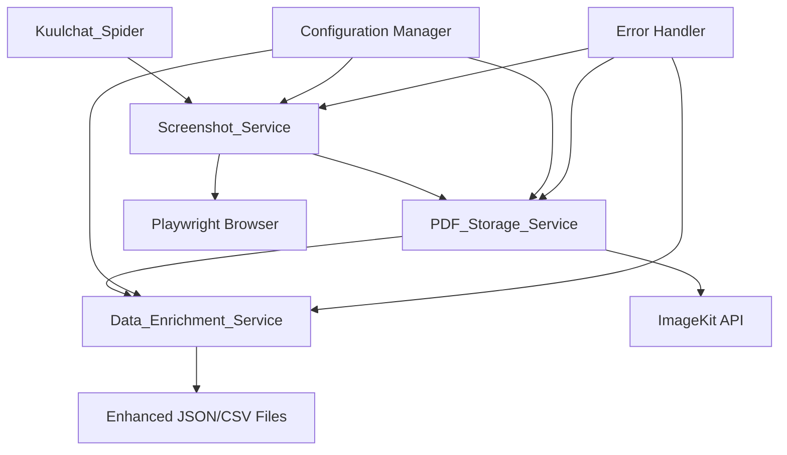

# Design Document

## Overview

The screenshot-pdf-integration feature extends the existing BECE Questions Data Scraper with visual archiving capabilities. The design follows a modular approach with three main services: Screenshot_Service (Playwright-based), PDF_Storage_Service (ImageKit-based), and Data_Enrichment_Service. The integration is designed to be non-intrusive, optional, and fault-tolerant to preserve existing functionality.

## Architecture

### High-Level Architecture



### Component Interaction Flow

1. **Scraping Phase**: Kuulchat_Spider extracts data as usual
2. **Screenshot Phase**: Screenshot_Service captures page visuals
3. **Storage Phase**: PDF_Storage_Service uploads to ImageKit
4. **Enrichment Phase**: Data_Enrichment_Service updates output files
5. **Completion**: Enhanced files with PDF URLs are generated

## Components and Interfaces

### 1. Screenshot Service

**File**: `services/screenshot_service.py`

**Purpose**: Manages browser automation and screenshot capture using Playwright

**Key Methods**:

```python
class ScreenshotService:
    async def initialize_browser(self, headless: bool = True) -> None
    async def capture_screenshot(self, url: str, output_path: str) -> bool
    async def capture_full_page_screenshot(self, url: str, output_path: str) -> bool
    async def cleanup_browser(self) -> None
    def configure_viewport(self, width: int, height: int) -> None
```

**Configuration Options**:

- Browser type (chromium, firefox, webkit)
- Viewport dimensions
- Screenshot format (PNG, JPEG)
- Quality settings
- Timeout values

### 2. PDF Storage Service

**File**: `services/pdf_storage_service.py`

**Purpose**: Handles PDF conversion and ImageKit integration

**Key Methods**:

```python
class PDFStorageService:
    def __init__(self, imagekit_config: dict)
    def convert_image_to_pdf(self, image_path: str, pdf_path: str) -> bool
    def upload_pdf_to_imagekit(self, pdf_path: str, metadata: dict) -> str
    def generate_filename(self, subject: str, year: str) -> str
    def organize_in_folders(self, subject: str, year: str) -> str
    def retry_upload(self, pdf_path: str, metadata: dict, max_retries: int = 3) -> str
```

**ImageKit Integration**:

- Authentication via API keys
- Folder organization: `/screenshots/{subject}/{year}/`
- Metadata tagging for searchability
- URL generation for embedded links

### 3. Data Enrichment Service

**File**: `services/data_enrichment_service.py`

**Purpose**: Integrates PDF URLs into existing JSON and CSV files

**Key Methods**:

```python
class DataEnrichmentService:
    def enrich_json_file(self, json_path: str, pdf_url: str) -> bool
    def enrich_csv_file(self, csv_path: str, pdf_url: str) -> bool
    def backup_original_files(self, file_paths: list) -> bool
    def validate_file_integrity(self, file_path: str) -> bool
```

**Data Structure Enhancement**:

- Adds `page_screenshot_pdf` field to JSON root level
- Adds `page_screenshot_pdf` column to CSV files
- Preserves all existing data structure
- Creates backup files before modification

### 4. Configuration Manager

**File**: `config/screenshot_config.py`

**Purpose**: Centralized configuration management

**Configuration Structure**:

```python
SCREENSHOT_CONFIG = {
    'enabled': True,
    'playwright': {
        'browser_type': 'chromium',
        'headless': True,
        'viewport': {'width': 1920, 'height': 1080},
        'timeout': 30000,
        'screenshot_format': 'png',
        'quality': 90
    },
    'imagekit': {
        'public_key': os.getenv('IMAGEKIT_PUBLIC_KEY'),
        'private_key': os.getenv('IMAGEKIT_PRIVATE_KEY'),
        'url_endpoint': os.getenv('IMAGEKIT_URL_ENDPOINT'),
        'folder_structure': '/screenshots/{subject}/{year}/'
    },
    'pdf': {
        'quality': 95,
        'format': 'A4',
        'margin': {'top': 20, 'bottom': 20, 'left': 20, 'right': 20}
    }
}
```

## Data Models

### Screenshot Metadata Model

```python
@dataclass
class ScreenshotMetadata:
    subject: str
    year: str
    url: str
    timestamp: datetime
    filename: str
    file_size: int
    dimensions: tuple[int, int]
    
class PDFUploadResult:
    success: bool
    url: str
    file_id: str
    error_message: str = None
```

### Enhanced Output Structure

**JSON Enhancement**:

```json
{
    "subject": "science",
    "year": "2022",
    "page_screenshot_pdf": "https://ik.imagekit.io/your-id/screenshots/science/2022/science_2022_20241026.pdf",
    "questions": [...],
    "metadata": {...}
}
```

**CSV Enhancement**:

```csv
subject,year,page_screenshot_pdf,question_number,question_text,...
science,2022,https://ik.imagekit.io/your-id/screenshots/science/2022/science_2022_20241026.pdf,1,"What is...",...
```

## Error Handling

### Error Categories and Responses

1. **Browser Initialization Errors**
   - Fallback to different browser types
   - Graceful degradation without screenshots
   - Detailed logging for debugging

2. **Screenshot Capture Errors**
   - Retry with different viewport settings
   - Timeout handling with progressive delays
   - Continue processing without visual archive

3. **PDF Conversion Errors**
   - Validate image file integrity
   - Retry with different quality settings
   - Log conversion failures for manual review

4. **ImageKit Upload Errors**
   - Exponential backoff retry strategy
   - Network timeout handling
   - Authentication error recovery

5. **Data Enrichment Errors**
   - File backup and rollback mechanisms
   - Validation of JSON/CSV integrity
   - Partial success handling

### Error Recovery Strategy

```python
class ErrorHandler:
    def handle_screenshot_error(self, error: Exception, context: dict) -> bool
    def handle_upload_error(self, error: Exception, retry_count: int) -> bool
    def handle_enrichment_error(self, error: Exception, backup_path: str) -> bool
    def log_error_with_context(self, error: Exception, context: dict) -> None
```

## Testing Strategy

### Unit Testing

**Test Coverage Areas**:

1. Screenshot Service browser management
2. PDF conversion functionality
3. ImageKit API integration
4. Data enrichment accuracy
5. Configuration validation
6. Error handling scenarios

**Test Files Structure**:

```text
tests/
├── unit/
│   ├── test_screenshot_service.py
│   ├── test_pdf_storage_service.py
│   ├── test_data_enrichment_service.py
│   └── test_configuration.py
├── integration/
│   ├── test_end_to_end_flow.py
│   └── test_imagekit_integration.py
└── fixtures/
    ├── sample_pages/
    └── test_data/
```

### Integration Testing

**Test Scenarios**:

1. Complete workflow from scraping to PDF storage
2. ImageKit API connectivity and authentication
3. File system operations and cleanup
4. Configuration loading and validation
5. Error scenarios and recovery

### Mock Strategy

**External Dependencies**:

- Mock ImageKit API responses for unit tests
- Mock Playwright browser for isolated testing
- Mock file system operations for data safety
- Use test ImageKit account for integration tests

## Performance Considerations

### Optimization Strategies

1. **Concurrent Processing**
   - Async/await for I/O operations
   - Parallel screenshot capture when possible
   - Batch PDF uploads to ImageKit

2. **Resource Management**
   - Browser instance reuse across screenshots
   - Memory cleanup after processing
   - Temporary file management

3. **Caching Strategy**
   - Cache browser instances
   - Store ImageKit authentication tokens
   - Reuse PDF conversion settings

### Performance Metrics

- Screenshot capture time per page
- PDF conversion duration
- ImageKit upload speed
- Memory usage during processing
- Overall workflow completion time

## Security Considerations

### API Key Management

- Environment variable storage for ImageKit credentials
- No hardcoded secrets in codebase
- Secure credential validation at startup

### File Security

- Temporary file cleanup after processing
- Secure PDF generation without sensitive data exposure
- Validation of file paths to prevent directory traversal

### Network Security

- HTTPS-only communication with ImageKit
- Request timeout limits
- Input validation for URLs and file paths

## Deployment and Configuration

### Environment Setup

**Required Environment Variables**:

```bash
IMAGEKIT_PUBLIC_KEY=your_public_key
IMAGEKIT_PRIVATE_KEY=your_private_key
IMAGEKIT_URL_ENDPOINT=https://ik.imagekit.io/your_id
SCREENSHOT_ENABLED=true
PLAYWRIGHT_BROWSER=chromium
```

**Dependencies Addition**:

```toml
# pyproject.toml additions
dependencies = [
    "scrapy>=2.13.3",
    "playwright>=1.40.0",
    "imagekitio>=3.0.0",
    "Pillow>=10.0.0",
    "reportlab>=4.0.0"
]
```

### Installation Steps

1. Install Playwright browsers: `playwright install chromium`
2. Configure ImageKit account and obtain API keys
3. Set environment variables
4. Run dependency installation: `uv sync`
5. Test configuration with dry-run mode

This design ensures seamless integration with your existing scraper while adding powerful visual archiving capabilities through Playwright and ImageKit.
